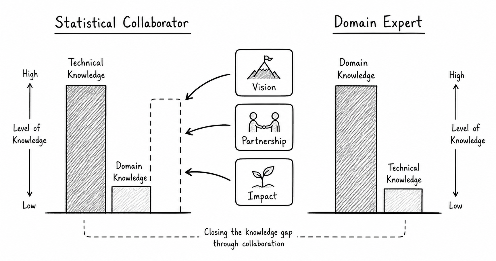
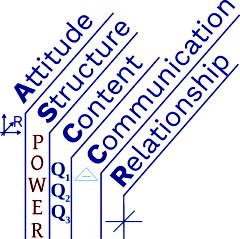
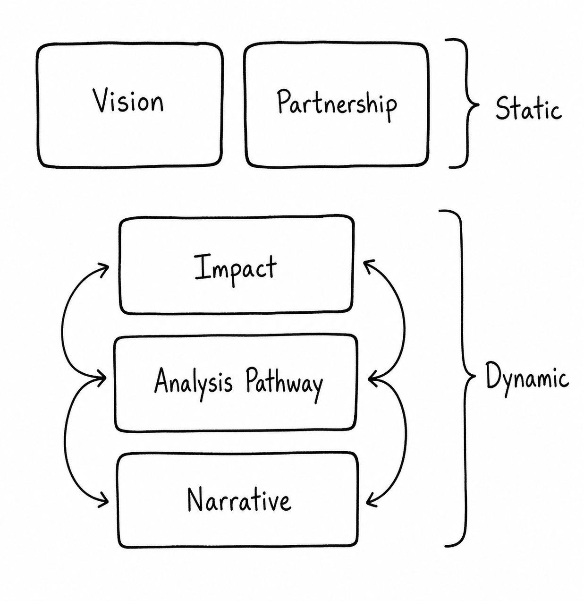

### The need for impact-centric consulting

The ASCCR and QQQ frameworks have demonstrated the importance of effective partnership between statisticians and domain experts. These frameworks, however, do not yet provide structure for planning and evaluating impact within statistical collaboration.

As the technical barriers to statistical analysis are lowered with the advent of AI, the role of the statistician is shifting. There is a growing need for practitioners who can leverage collaborative competencies to translate evidence into action. This requires planning for impact from the outset and making deep contributions to the domain problem.

The Designed For Impact Tool is a fillable worksheet that supports this process. It allows statisticians and domain experts to co-create impact by focusing on five key dimensions of a project: Vision, Partnership, Impact, Analysis Pathway, and Narrative. You don’t need to memorize these – that's why we created the tool. However, if statisticians meaningfully address each of these dimensions, we believe the result will be more intentional, cohesive, and impactful collaboration.

### Statistical foundations

The QQQ framework was first introduced by Leman et al. (2015) as a paradigm for learning and teaching data analytics and later expanded by Vance et al. (2025) to guide discussions of technical material with interdisciplinary collaborators. QQQ operates within the Content component of the broader ASCCR framework (Attitude, Structure, Content, Communication, Relationship) developed by Vance and Smith (2019), which helps move practitioners from good collaborators to great collaborators.

These frameworks provide a strong foundation for statistical consulting, and we're taking the opportunity to extend this work by bolstering Q1, Q2, and Q3, as well as introducing a retrospective step at project close-out. The Designed For Impact Tool is rooted in these existing frameworks and scaffolds new conversations between statisticians and domain experts – conversations that move beyond the research question and interpretation of statistical results to explicitly connect analysis to action.

{fig-align="center"}

### Design foundations

Across industry, structured frameworks are widely used to navigate complex, multi-dimensional problems. One well-known example is the SWOT analysis (Strengths, Weaknesses, Opportunities, Threats), introduced by Stewart et al. (1965) to support strategic planning. These tools serve a common purpose: to reduce cognitive load. By breaking complex problems into distinct components, they help practitioners avoid overlooking critical elements and apply more systematic thinking.

The Designed For Impact Tool follows this same principle. Statistical consulting projects are inherently complex – they require tremendous context building, intentional methodological decisions, and clear communication to non-experts. Each project presents an opportunity to make a deep contribution to a collaborator’s domain, but doing so requires thoughtful planning. The Designed For Impact Tool facilitates problem disaggregation and is tailored to the needs of statistical collaborators.

{fig-align="center" width="428"}

### Conclusion

The Designed For Impact Tool is a collaborative scaffolding tool for translating evidence into action. It takes the form of a fillable worksheet, similar to many tools used in organizational and strategic contexts, but it is specifically designed for statistical collaboration. The dimensions of the tool (Vision, Partnership, Impact, Analysis Pathway, and Narrative) were developed inductively and are grounded in the ASCCR and QQQ frameworks. Together, they guide statisticians and domain experts toward more intentional, aligned, and impactful partnerships. 

Used throughout the lifecycle of a project, the Designed For Impact Tool helps transform consulting from a collection of disjointed tasks into a cohesive, impact-oriented, iterative process. It supports deeper contributions to the collaborator’s domain, strengthens communication of value, and integrates cleanly into the statistician’s existing workflow.
